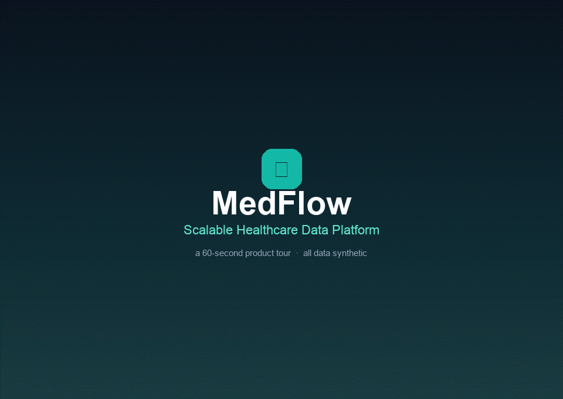
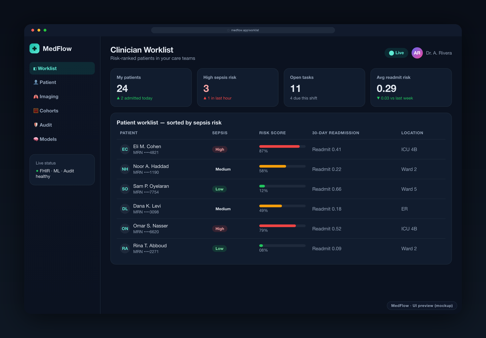
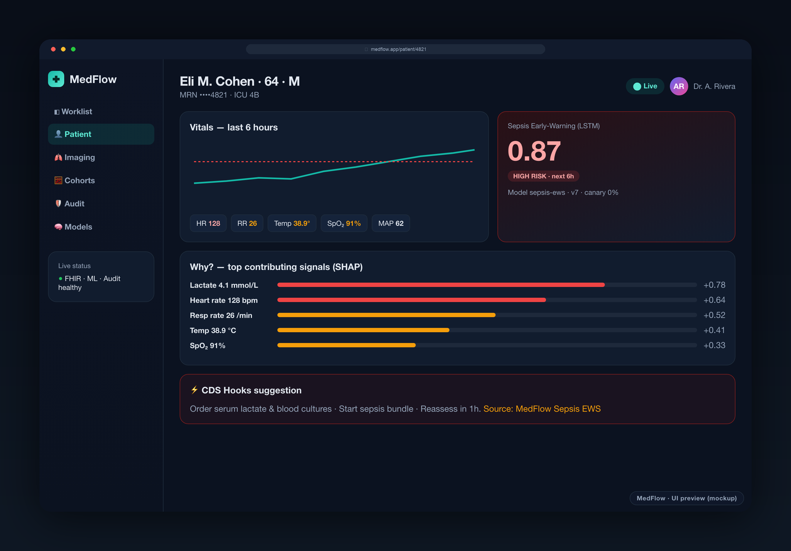
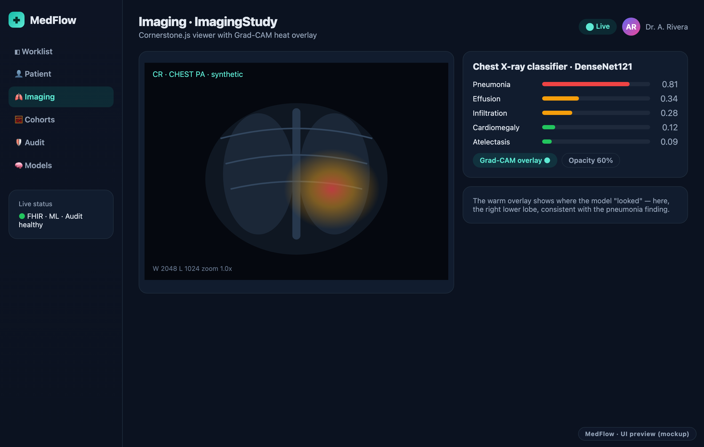
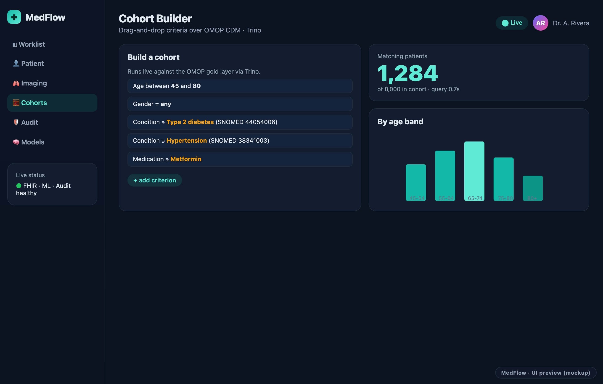
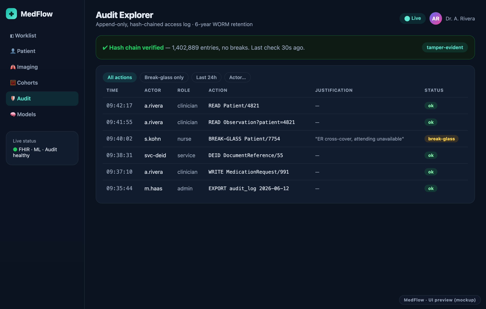
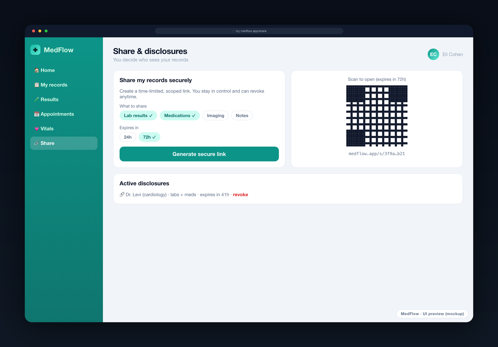
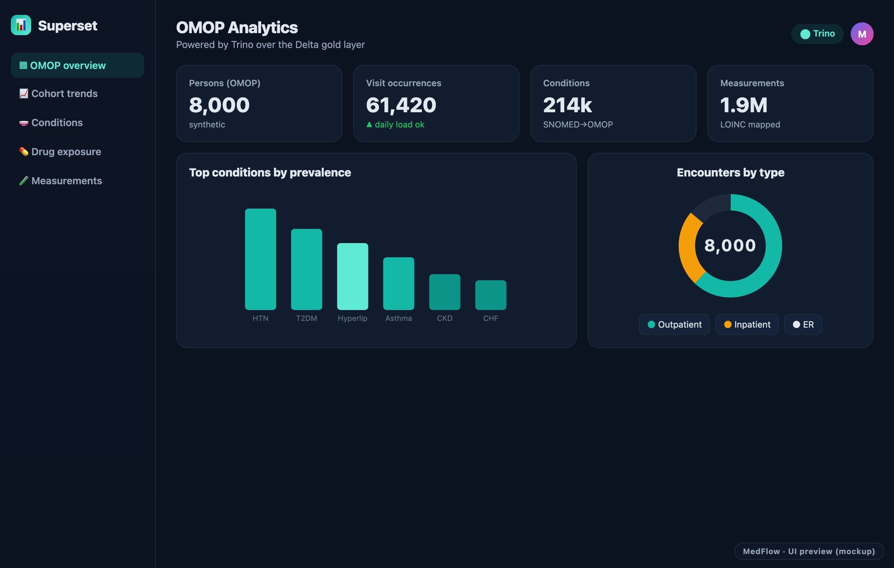
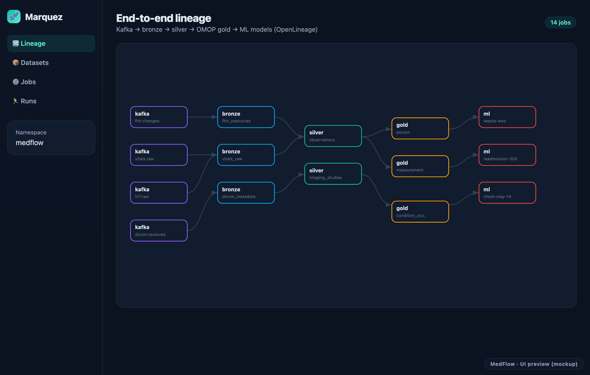
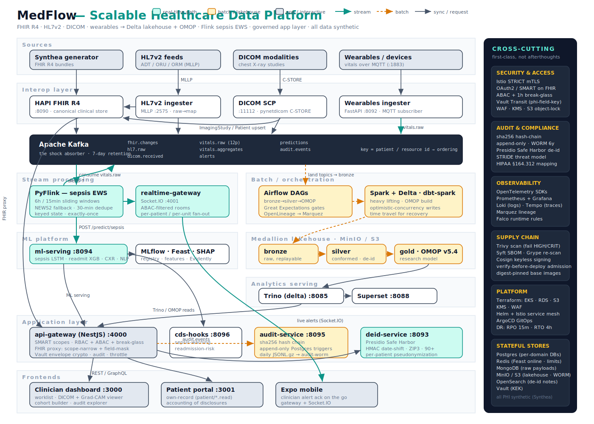

<div align="center">

# MedFlow — Scalable Healthcare Data Platform

**An end-to-end, HIPAA-aware clinical data platform: standards-based interop (FHIR R4 · HL7v2 · DICOM), a Delta-Lake lakehouse transformed to the OMOP Common Data Model, three production-style clinical ML models, and multi-stakeholder apps — built to demonstrate engineering in a regulated, high-trust domain.**

[](./.github/workflows/ci.yml)
[](./LICENSE)
[](https://hl7.org/fhir/R4/)
[](https://ohdsi.github.io/CommonDataModel/)
[](https://hl7.org/fhir/smart-app-launch/)
[](https://www.python.org/)
[](https://www.typescriptlang.org/)
[](https://openjdk.org/)

[](https://yousef-hamda.github.io/medflow-healthcare-platform/EXPLAINER.html)
&nbsp;
[](EXPLAINER.pdf)

</div>

> [!IMPORTANT]
> **All data in this project is synthetic. No real patient data or PHI is used anywhere — ever.**
> Patients are generated by [Synthea](https://github.com/synthetichealth/synthea); HL7v2, DICOM, and
> wearable streams are simulated; the optional chest-X-ray model fine-tunes on the public, research-use-only
> [NIH ChestX-ray14](https://nihcc.app.box.com/v/ChestXray-NIHCC) dataset (never redistributed here).
> The platform is nonetheless engineered *as if* it handled real PHI — that discipline is the point.

---

> [!TIP]
> ### 📘 Not a coder? Read this first — [`EXPLAINER.html`](EXPLAINER.html)
> An illustrated, animated, plain-English walkthrough of the whole project — **no technical
> background needed.** Inside you'll find:
> - 🏥 a one-sentence summary and an everyday "smart hospital receptionist" analogy
> - 💓 an animated *"journey of a heartbeat"* showing how data becomes a live alert
> - 🧩 the 5 main parts explained simply, each with a "what the coder words mean" note
> - 👀 one tiny piece of real code, annotated line-by-line
> - 📖 a mini-dictionary of tech terms (API, database, container, cloud…) and an animated screen tour
>
> **How to open it:** click **[▶ view it rendered online](https://yousef-hamda.github.io/medflow-healthcare-platform/EXPLAINER.html)**
> (one click, nothing to install), **or** download the repo and double-click `EXPLAINER.html` in any browser.
> Prefer no browser? Read the **[PDF](EXPLAINER.pdf)**. Want to email it to someone? Send the
> self-contained **[`EXPLAINER-standalone.html`](EXPLAINER-standalone.html)** (images baked in, works on its own).

## What it is

MedFlow ingests synthetic clinical data through the same standard interfaces a real hospital integration
uses — a **HAPI FHIR R4** server, an **HL7v2 MLLP** feed, a **DICOM C-STORE** receiver, and a streaming
**wearable-vitals** ingester — and lands it in a **medallion lakehouse** (Delta Lake on MinIO:
bronze → silver → gold). The gold layer is the **OMOP Common Data Model**, produced by **dbt** so the
analytics estate is research-grade and tool-compatible. Orchestration is **Airflow**; transformation is
**Spark**; real-time scoring is **Flink**; data quality is gated by **Great Expectations**; lineage flows to
**Marquez** via **OpenLineage**; analysts query **Trino** and explore **Superset**.

On top of that data, three clinical models run with proper evaluation and **model cards**: a **PyTorch LSTM
sepsis early-warning** model served through a Flink streaming job (with a NEWS2 rule-based fallback), an
**XGBoost 30-day readmission** model, and a **DenseNet121 chest-X-ray** classifier with Grad-CAM — plus a
**medspaCy** clinical-note NLP pipeline. Models are versioned in **MLflow**, fed by **Feast**, explained with
**SHAP**, and monitored for drift with **Evidently**.

Results reach users through a **NestJS API gateway** (OAuth 2.0 / **SMART on FHIR** scopes, **ABAC** with
care-team attributes and a break-glass path, Vault-backed field encryption, and an audit interceptor on every
request), a **Socket.IO** realtime feed, a **CDS Hooks** service, a **Next.js clinician dashboard** (with an
in-browser **Cornerstone.js** DICOM viewer and Grad-CAM overlay), a **Next.js patient portal**, and a
**React Native (Expo)** mobile app.

The differentiator is that the **compliance posture is visible, not buried**: envelope encryption of direct
identifiers via **HashiCorp Vault Transit**, a **tamper-evident hash-chained audit log** with WORM export,
**Presidio**-based HIPAA Safe Harbor de-identification, **Istio mTLS**, **Falco** runtime rules, and
**Trivy/Syft/Cosign** supply-chain controls — all written up as a SOC 2 / HIPAA-style gap analysis in
[`docs/compliance.md`](docs/compliance.md).

---

## Screenshots

<div align="center">



</div>

> [!NOTE]
> The images below are **representative UI previews (mockups)** that show the intended look and information
> design of each screen — they are illustrations, not captures of the live running system. Real screenshots
> (and richer GIFs) can replace them once the stack is started and seeded; the capture guide and exact
> filenames are in [`docs/images/README.md`](docs/images/README.md).

| Clinician worklist (risk-ranked) | Patient view — sepsis risk + SHAP |
|---|---|
|  |  |

| DICOM viewer with Grad-CAM overlay | Cohort builder on OMOP via Trino |
|---|---|
|  |  |

| Audit log explorer (chain status) | Patient portal — disclosures / share |
|---|---|
|  |  |

| Superset OMOP dashboard | Marquez end-to-end lineage |
|---|---|
|  |  |

The looping tour above (`docs/images/demo.gif`) walks through these same screens.

---

## Architecture



Full walkthrough in [`docs/architecture.md`](docs/architecture.md). The platform is a polyglot set of services
communicating over **Kafka** (event backbone), **REST/gRPC** (sync calls), and **Delta** (analytical data),
each instrumented with **OpenTelemetry**.

```
SOURCES (synthetic)        INTEROP                 BACKBONE        PROCESSING                 SERVING / APPS
─────────────────────      ───────────────────     ─────────       ───────────────────────    ──────────────────────
Synthea generator     ─►   HAPI FHIR R4 (:8090) ─┐                 Flink  (sepsis stream) ─┐   API gateway (:4000)
HL7v2 ADT/ORU/ORM     ─►   HL7v2 MLLP (:2575)   ─┤  Kafka topics   Spark  (batch / dbt)   ─┤   Realtime WS (:4001)
DICOM C-STORE         ─►   DICOM SCP (:11112)   ─┼─►  fhir.changes  Airflow (orchestration)─┼─► CDS Hooks (:8096)
Wearable vitals (MQTT)─►   Wearables API (:8092)─┘   hl7.raw …      Delta bronze│silver│gold   Clinician dashboard (:3000)
                                                                    OMOP CDM (dbt)             Patient portal (:3001)
                                                    MinIO (S3)      Trino · Superset · Marquez Mobile (Expo)
                                                                    MLflow · Feast · SHAP
PLATFORM / COMPLIANCE: Vault envelope encryption · hash-chained audit log + WORM · Presidio de-id ·
Istio mTLS · Falco · Trivy/Syft/Cosign · Prometheus/Grafana/Loki/Tempo · K8s/Helm/ArgoCD · Terraform (AWS)
```

---

## Tech stack

| Domain | Technologies |
|---|---|
| **Healthcare interop** | HAPI FHIR R4 (Java/Spring Boot), HAPI HL7v2, pynetdicom + pydicom, SMART on FHIR, CDS Hooks, Synthea |
| **Data engineering** | Apache Spark 3.5, Airflow 2.9, Flink 1.18 (PyFlink), Delta Lake on MinIO, dbt → OMOP CDM v5.4, Great Expectations, OpenLineage + Marquez, Trino, Superset |
| **Machine learning** | PyTorch + Lightning (sepsis LSTM), XGBoost (readmission), DenseNet121 transfer learning + Grad-CAM (chest X-ray), medspaCy/scispaCy (NLP), MLflow, Feast, SHAP, Evidently, BentoML, FastAPI |
| **Application services** | NestJS (OAuth2/OIDC + SMART scopes, ABAC, GraphQL), Node + Socket.IO, CDS Hooks service, Python + Microsoft Presidio (de-id) |
| **Web & mobile** | Next.js 14 (App Router), React 18, TypeScript strict, Tailwind + shadcn-style UI, Cornerstone.js (DICOM), TanStack Query, Zustand, Zod, next-intl (en/he/ar + RTL); React Native + Expo (biometric unlock, offline cache) |
| **Data stores** | PostgreSQL 16, MongoDB 7, Redis 7, Apache Kafka (KRaft), MinIO (Delta), OpenSearch |
| **Security & compliance** | HashiCorp Vault (Transit envelope encryption), Falco, Trivy, Syft + Grype, Cosign, Istio mTLS, network policies |
| **Cloud-native infra** | Docker, Kubernetes, Helm, Istio, ArgoCD (GitOps), Terraform (EKS + RDS + S3 + KMS + IAM + WAF), GitHub Actions |
| **Observability** | OpenTelemetry across every service, Prometheus + Grafana, Loki, Tempo |

---

## Skills demonstrated

- **Healthcare interoperability** — FHIR R4, HL7v2 (ADT/ORU/ORM → FHIR mapping), DICOM C-STORE, SMART on FHIR launch & scopes, CDS Hooks decision support.
- **Data engineering at scale** — Spark on Kubernetes, Airflow orchestration, Flink streaming, Delta-Lake lakehouse (bronze/silver/gold), dbt to **OMOP CDM**, Great Expectations data-quality gates, OpenLineage + Marquez lineage, Trino + Superset.
- **Machine learning** — PyTorch LSTM sepsis early warning, XGBoost readmission risk, DenseNet121 transfer learning for chest X-ray with Grad-CAM, medspaCy clinical NLP, MLflow + Feast + SHAP + Evidently drift, **model cards with subgroup fairness analysis**.
- **Full-stack web** — Next.js, React, TypeScript, REST + GraphQL, Cornerstone.js DICOM viewer with Grad-CAM overlay, i18n with RTL, WCAG AA.
- **Mobile** — React Native + Expo, biometric unlock, offline-tolerant read caching, push notifications.
- **Microservices** — Java/Spring Boot, Python/FastAPI, Node/NestJS polyglot orchestration over Kafka + REST + gRPC.
- **Security & compliance** — Vault envelope encryption of PHI fields, SMART on FHIR OAuth scopes, RBAC + ABAC with break-glass, tamper-evident hash-chained audit log with WORM backup, Presidio HIPAA Safe Harbor de-identification, Falco runtime threat detection, Trivy + Syft + Cosign supply-chain security.
- **Cloud-native deployment** — Docker, Kubernetes, Helm, Istio service mesh with mTLS, ArgoCD GitOps, Terraform AWS skeleton (EKS + RDS + KMS + S3 + WAF).
- **Observability** — OpenTelemetry across services; Prometheus + Grafana + Loki + Tempo.
- **Quality engineering** — FHIR conformance (Inferno) hooks, Pact contract tests, Playwright + Maestro E2E, k6 load tests, Testcontainers integration tests, ≥70% coverage gates.
- **Domain modeling** — OMOP CDM for analytics, FHIR for operational interop (rationale in the ADRs).

---

## Quick start

**Prerequisites:** Docker + Docker Compose, `make`, and ~12 GB of RAM free. (Node 20 / pnpm 9, Python 3.11, and
JDK 17 are only needed if you run services outside containers.)

```bash
# 1. Bring up the full stack (first build pulls images + compiles services)
make dev

# 2. Generate and load 500 synthetic patients (FHIR bundles + bronze landing)
make seed-patients N=500

# 3. Drive the simulators — vitals includes two patients trending toward sepsis
make sim-vitals        # streaming vitals over MQTT
make sim-hl7           # replay HL7v2 ADT/ORU/ORM over MLLP
make sim-dicom         # push sample chest X-rays via DICOM C-STORE

# 4. (optional) Train models — otherwise serving uses documented cold-start scorers
make train-sepsis
make train-readmission
make download-chestxray && make train-xray
```

| Surface | URL | Notes |
|---|---|---|
| Clinician dashboard | http://localhost:3000 | worklist · patient 360 · DICOM viewer · cohort builder · audit · models |
| Patient portal | http://localhost:3001 | records · results · vitals · messaging · share |
| API gateway | http://localhost:4000/docs | Swagger; GraphQL at `/graphql`; OAuth at `/oauth/*` |
| FHIR server | http://localhost:8090/fhir | HAPI FHIR R4; `/.well-known/smart-configuration` |
| ML serving | http://localhost:8094/docs | sepsis · readmission · chest-xray · notes |
| Airflow | http://localhost:8080 | `admin` / `admin` |
| MLflow | http://localhost:5000 | model registry & experiments |
| MinIO console | http://localhost:9001 | `minio_admin` / `minio_dev_password` |
| Superset | http://localhost:8088 | `admin` / `admin` |
| Marquez lineage | http://localhost:3003 | bronze → silver → gold → ML graph |
| Grafana | http://localhost:3002 | `admin` / `admin` |

Run `make help` for the full target list (`make sim-*`, `make airflow`, `make trino`, `make compliance-report`,
`make audit-query`, `make scan`, `make k8s-up`, …).

> [!NOTE]
> **Credentials in `docker-compose.yml` are development-only** (plaintext Kafka, Vault dev root token, shared
> MinIO keys, `admin/admin` UIs). They are **not** the production design — see
> [`docs/deployment.md`](docs/deployment.md) and [`docs/compliance.md`](docs/compliance.md) for the
> per-environment secrets story (Vault → AWS Secrets Manager + External Secrets).

---

## Repository layout

```
medflow/
├── apps/                      # 14 services (see table below)
├── packages/                  # shared-types, fhir-types, ui, proto
├── ml/                        # notebooks, Feast feature repo, model cards, sample data
├── data/                      # Airflow DAGs, Flink job, dbt OMOP project, Great Expectations, lineage
├── compliance/                # threat model, access policies, audit queries, de-id rules
├── infra/                     # docker configs, k8s, Helm, Istio, ArgoCD, Terraform, observability, Vault, Falco
├── docs/                      # architecture, compliance, interop, ml, data-lake, deployment, ADRs, runbooks
├── scripts/                   # seeder, simulators, scans, load tests, compliance report, PHI-logging hook
├── tests/contract/            # Pact consumer contracts
├── .github/workflows/         # ci.yml, release.yml
├── docker-compose.yml         # full local stack (41 services)
└── Makefile                   # one-command dev workflow
```

| Service (`apps/`) | Stack | Purpose |
|---|---|---|
| `fhir-server` | Java / Spring Boot / HAPI FHIR | FHIR R4 store; publishes change events to Kafka |
| `hl7v2-ingester` | Java / HAPI HL7v2 | MLLP listener; maps ADT/ORU/ORM → FHIR |
| `dicom-receiver` | Python / pynetdicom | DICOM SCP → MinIO + ImagingStudy + preprocessing |
| `wearables-ingester` | Python / FastAPI + MQTT | streaming vitals → Postgres + Kafka |
| `deid-service` | Python / Presidio | HIPAA Safe Harbor de-identification |
| `ml-serving` | Python / BentoML + FastAPI | multi-model inference + SHAP + Grad-CAM |
| `ml-batch` | Python / PySpark + Lightning | training, feature backfill, drift, cohorts |
| `api-gateway` | NestJS | OAuth/SMART, ABAC, FHIR proxy, analytics, audit |
| `realtime-gateway` | Node / Socket.IO | patient-scoped live alert feed |
| `cds-hooks-service` | Node / Fastify | CDS Hooks sepsis + readmission cards |
| `audit-service` | Node / Fastify | append-only hash-chained audit log + WORM export |
| `clinician-dashboard` | Next.js | provider UI |
| `patient-portal` | Next.js | patient UI |
| `patient-mobile` | React Native / Expo | patient mobile app |

---

## Documentation

| Doc | What's inside |
|---|---|
| [Architecture](docs/architecture.md) | component walkthrough, data-flow narratives, scaling & failure modes |
| [**Compliance**](docs/compliance.md) | **HIPAA-style gap analysis** — the flagship artifact |
| [Interop](docs/interop.md) | FHIR/HL7v2/DICOM mappings, SMART launch, CDS Hooks examples |
| [ML](docs/ml.md) | model framing, features, evaluation, canary, drift |
| [Data lake](docs/data-lake.md) | medallion design, OMOP rationale, GE gates, lineage |
| [Deployment](docs/deployment.md) | compose / kind+Helm / AWS Terraform, secrets, image signing |
| [ADRs](docs/adr/) | 5 architecture decision records (Nygard format) |
| [Runbooks](docs/runbooks/) | DAG failure, FHIR 5xx, sepsis alert spike, audit-chain break, restore drill |
| [Model cards](ml/model_cards/) | one per model, with subgroup fairness analysis & citations |
| [Threat model](compliance/threat-model.md) | STRIDE per trust boundary |

---

## Testing & quality

- **Unit tests** per service with a **≥70% coverage gate** in CI (Vitest/Jest, pytest, JUnit).
- **Contract tests** (Pact) between dashboard ↔ gateway and gateway ↔ ML serving.
- **E2E** — Playwright journeys (clinician login → patient → sepsis ack; portal lab results; cohort builder),
  Maestro flow on mobile (login → results → biometric re-auth).
- **FHIR conformance** — Inferno suite job (schedule/label-gated) against the FHIR server.
- **Load** — k6 simulating 200 concurrent FHIR readers (`scripts/load/fhir.js`).
- **Data quality** — Great Expectations checkpoints block downstream Airflow tasks on failure.
- **Supply chain** — Trivy (fail on HIGH/CRITICAL), Syft SBOM, Grype, Cosign signing in CI.
- **PHI-safe logging** — a custom AST/regex pre-commit hook flags log calls that reference PHI field names.

---

## A note on scope & honesty

This is a **portfolio project built entirely on synthetic data**. A few deliberate, documented boundaries:

- **No real PHI, no production secrets.** Compose ships dev-only credentials; production uses Vault / AWS SM.
- **`pnpm-lock.yaml` is not committed in this snapshot** — run `pnpm install` once at the root to generate it;
  Docker builds tolerate its absence, and CI is annotated to switch back to `--frozen-lockfile` afterward.
- **The compliance doc is honest about gaps** — it ends with an explicit table of what a real HIPAA posture
  still needs (BAAs, formal §164.308(a)(1) risk analysis, workforce training, pen test, SOC 2 / HITRUST).
- The chest-X-ray model targets **NIH ChestX-ray14 (research use only)**; the dataset is never redistributed here.

---

## License & attributions

- Code: **MIT** — see [LICENSE](LICENSE).
- **Synthea** (Apache 2.0) generates all synthetic patients.
- **NIH ChestX-ray14** — research-use-only; provided by the NIH Clinical Center; not redistributed.

## Author

**Yousef Hasan Hamda**
LinkedIn: [in/yousef-hamda-1093a4352](https://www.linkedin.com/in/yousef-hamda-1093a4352) · Email: yousef123hamda@gmail.com
