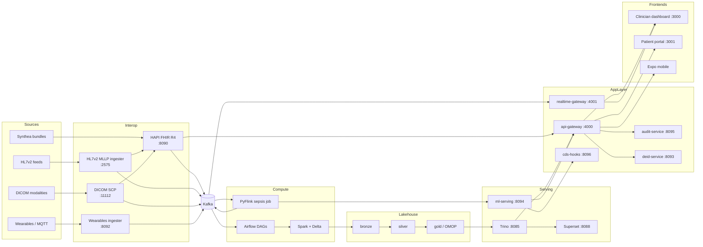

# MedFlow Architecture

> All patient data in this platform is **synthetic** (Synthea). The architecture is designed as if it
> handled real PHI, so every claim below should be read as "what the design does", with dev-only
> shortcuts (plaintext Kafka listeners, dev Vault root token, MinIO root creds) called out explicitly
> in [deployment.md](deployment.md) and [compliance.md](compliance.md).

## 1. System overview

MedFlow is a healthcare data platform monorepo that takes data from four source modalities
(FHIR bundles, HL7v2 feeds, DICOM studies, wearable vitals), normalizes everything toward
**FHIR R4 as the operational canonical model** and **OMOP CDM as the analytical canonical model**,
and serves three consumption surfaces:

1. **Real-time clinical decision support** — a PyFlink job scoring vitals against a sepsis LSTM,
   surfacing alerts through Socket.IO and CDS Hooks.
2. **Analytics** — a Delta Lake medallion lakehouse on MinIO, queried by Trino and Superset,
   with OMOP as the gold layer.
3. **Applications** — a NestJS API gateway fronting FHIR, ML serving, and Trino for a Next.js
   clinician dashboard, patient portal, and Expo mobile app.

Cross-cutting concerns — audit, de-identification, encryption, lineage, observability — are
first-class services, not afterthoughts, because they are the point of the project.

## 2. Component walkthrough

### 2.1 Sources and simulators

| Component | Entry point | What it produces |
|---|---|---|
| Synthea generator | `make seed-patients N=500` (`scripts/seed_patients.sh`) | FHIR R4 bundles posted to the FHIR server; raw bundles archived in MinIO `synthea-raw` |
| HL7v2 replayer | `make sim-hl7` (`scripts/simulators/hl7_replay.py`) | ADT/ORU/ORM messages over MLLP at a configurable rate |
| DICOM pusher | `make sim-dicom` (`scripts/simulators/dicom_push.py`) | Chest X-ray studies via C-STORE |
| Vitals streamer | `make sim-vitals` (`scripts/simulators/vitals_stream.py`) | MQTT vitals, including patients deliberately trending toward sepsis so the alerting path is exercisable end to end |

### 2.2 Interop layer

**HAPI FHIR R4 server (`apps/fhir-server`, :8090).** Spring Boot/HAPI JPA backed by the `fhir`
Postgres database. It is the operational source of truth for clinical resources. A subscription-style
interceptor publishes every resource create/update as a change event to the `fhir.changes` Kafka
topic, which is what decouples the lakehouse and realtime consumers from the FHIR transactional
path. Health is exposed at `/actuator/health`.

**HL7v2 ingester (`apps/hl7v2-ingester`, MLLP :2575, admin :8097).** Listens for MLLP-framed
HL7v2. Every raw message is published verbatim to `hl7.raw` (the replayable archive) **before**
mapping, so a mapping bug never loses data. ADT^A01/A04/A08/A03 map to Patient + Encounter
upserts, ORU^R01 to Observations, ORM^O01 to ServiceRequests; mapped resources are written to
the FHIR server over its REST API. ACK/NAK semantics follow HL7 MLLP: a message is ACKed only
after the raw copy is durably in Kafka. Field-level mapping tables live in [interop.md](interop.md).

**DICOM receiver (`apps/dicom-receiver`, DIMSE :11112, HTTP :8091).** A pynetdicom Storage SCP
(AE title `MEDFLOW`). On C-STORE it: (1) writes the instance to the MinIO `imaging` bucket keyed
by StudyInstanceUID/SeriesInstanceUID/SOPInstanceUID, (2) upserts a FHIR `ImagingStudy` (and
Patient link) on the FHIR server, (3) emits a manifest event to `dicom.received`. Pixel data never
transits Kafka — only metadata and object pointers.

**Wearables ingester (`apps/wearables-ingester`, :8092).** FastAPI service subscribed to the
Mosquitto MQTT broker (:1883). It validates device payloads, normalizes units, writes a hot copy
to the `vitals` Postgres database, and publishes each reading to `vitals.raw` keyed by patient ID
(12 partitions — the highest-volume topic in the system).

### 2.3 Kafka

Single-broker KRaft locally (`bitnami/kafka:3.7`), auto-topic-creation disabled; topics are created
by `kafka-init` from `infra/docker/kafka/create-topics.sh`. All topics carry 7-day retention
locally; the durable archive is the lakehouse and the WORM bucket, not Kafka.

| Topic | Partitions | Producer(s) | Consumer(s) | Payload / key |
|---|---|---|---|---|
| `fhir.changes` | 6 | fhir-server interceptor | Airflow→bronze, realtime-gateway | resource change envelope; key = resource type+id |
| `hl7.raw` | 6 | hl7v2-ingester | Airflow `hl7_to_bronze` | raw MLLP message + metadata; key = MSH-10 control ID |
| `dicom.received` | 3 | dicom-receiver | Airflow `dicom_manifest_to_bronze` | study/series/instance manifest + MinIO object keys |
| `vitals.raw` | 12 | wearables-ingester | Flink sepsis job, Airflow `vitals_to_bronze` | one vital reading; key = patient ID (ordering per patient) |
| `vitals.aggregates` | 6 | Flink sepsis job | realtime-gateway (trend sparklines), lakehouse | windowed aggregates per patient/window |
| `alerts` | 3 | Flink sepsis job | realtime-gateway, audit-service | sepsis alert (score, window, model version or `news2-fallback`) |
| `predictions` | 6 | ml-serving | lakehouse (feature/label joins), Evidently drift jobs | every scored request: features hash, score, model version, canary arm |
| `audit.events` | 6 | api-gateway interceptor, services | audit-service (chains into Postgres) | audit envelope (actor, action, resource, justification) |

Partition counts are sized for local parallelism, not production throughput; key choice is the
load-bearing decision (per-patient ordering on `vitals.raw` is what makes Flink windowing correct).

### 2.4 Stream processing — the sepsis job

PyFlink 1.18 job (mounted from `data/flink/`, submitted by `make flink` →
`scripts/submit_flink_job.sh`):

1. Consumes `vitals.raw`, keyed by patient.
2. Maintains **6-hour sliding windows advancing every 15 minutes** of HR, RR, SBP, SpO₂, temp,
   level of consciousness.
3. On window fire, calls `ml-serving POST /predict/sepsis` with the windowed feature vector.
4. **Fallback:** if serving is unreachable or times out, computes a deterministic NEWS2 score from
   the same window and emits a rule-based alert instead — the alert payload is tagged with its
   provenance (`model` vs `news2-fallback`) so downstream consumers and dashboards can tell them
   apart.
5. **Dedupe:** per-patient keyed state suppresses repeat alerts for 30 minutes unless severity
   escalates.
6. Emits to `alerts` and window aggregates to `vitals.aggregates`.

### 2.5 Lakehouse and batch

Delta Lake on MinIO `s3://lakehouse` with bronze/silver/gold prefixes; Spark 3.5 (1 master,
1×2-core worker locally) does the heavy lifting; Trino's `delta` catalog
(`infra/docker/trino/catalog/delta.properties`) provides interactive SQL; Superset sits on Trino.
Full schemas, partitioning, and Great Expectations gates are in [data-lake.md](data-lake.md).

Airflow 2.9 (LocalExecutor, DAGs mounted read-only from `data/airflow/dags/`):

| DAG | Trigger | Function |
|---|---|---|
| `synthea_to_bronze` | after seed / daily | Synthea FHIR bundles (MinIO `synthea-raw`) → bronze Delta |
| `hl7_to_bronze` | hourly | `hl7.raw` topic → bronze, exactly-once via offset bookmarking in Delta |
| `vitals_to_bronze` | hourly | `vitals.raw` → bronze (the batch copy that backstops streaming) |
| `dicom_manifest_to_bronze` | hourly | `dicom.received` manifests → bronze |
| `bronze_to_silver` | daily, after bronze DAGs | dedupe, conform types, resolve patient identity, GE validation gate |
| `silver_to_omop` | daily, after silver | dbt-spark project building OMOP CDM gold tables, GE gate |
| `feature_backfill` | daily | recompute Feast offline features; materialize online to Redis |
| `audit_worm_export` | daily 02:00 | audit-service export of the day's `audit_log` slice as JSONL.gz to the object-locked `audit-worm` bucket |

Every DAG emits OpenLineage events to Marquez (`http://marquez:5001`, namespace `medflow`),
giving column-level lineage from topic → bronze → silver → OMOP → dashboard.

### 2.6 ML platform

MLflow 2.14 (Postgres backend, artifacts in MinIO `mlflow-artifacts`) is the registry; Feast with
Redis serves online features; `ml-serving` (:8094, FastAPI/BentoML) hosts the sepsis LSTM,
readmission XGBoost, DenseNet121 CXR model (research-use-only), and medspaCy NLP pipelines, and
logs every prediction to the `predictions` Postgres DB and Kafka topic. Canary routing splits
traffic by patient-ID hash (`CANARY_ENABLED=false` in local compose). Details, leakage guards,
and drift monitoring in [ml.md](ml.md).

### 2.7 Application layer

**api-gateway (`apps/api-gateway`, NestJS, :4000).** The single ingress for both frontends and
mobile. Responsibilities, in request order:

1. **AuthN** — OAuth2/OIDC issuer (dev: self-issued at `OIDC_ISSUER`), SMART on FHIR scopes
   (`patient/*.read`, `user/*.read`, …).
2. **AuthZ** — RBAC roles plus ABAC: care-team attributes (is this clinician on the patient's
   care team?) gate access beyond what scopes allow; **break-glass** grants a 1-hour elevation
   that requires a justification string and emits a distinct audit action.
3. **FHIR proxy** — narrows requested scopes, applies field-level masking (e.g. strips
   `Patient.telecom` for roles without `phi:contact`), and forwards to the FHIR server.
4. **Crypto** — phone/email columns in gateway-owned tables are envelope-encrypted via Vault
   Transit key `phi-field-key` (see [ADR-0003](adr/0003-vault-envelope-encryption.md)).
5. **Audit interceptor** — every request produces an `audit.events` record (actor, action,
   resource, IP, UA, justification when present).
6. **Rate limiting** — per-client (Redis-backed) limits.

Swagger at `/docs`, GraphQL at `/graphql`.

**realtime-gateway (:4001).** Socket.IO. Authenticates the same JWTs, subscribes to `alerts`,
`vitals.aggregates`, and `fhir.changes`, and fans out to per-patient/per-unit rooms with the same
ABAC checks as the REST path (an alert is only pushed to sockets whose user may see that patient).

**cds-hooks-service (:8096).** Implements two CDS Hooks: `sepsis-warning` on `patient-view`
(reads latest sepsis score from ml-serving) and `readmission-risk` on `encounter-discharge`
(synchronous XGBoost call). Returns cards with SMART app links into the dashboard. Examples in
[interop.md](interop.md).

**audit-service (:8095).** Consumes `audit.events` and direct HTTP writes; appends to the
hash-chained, trigger-protected `audit_log` table (`infra/docker/postgres/init-audit.sql`);
runs the daily WORM export; serves the verification endpoint used by `make compliance-report`.
Chain math and tamper-evidence analysis in [compliance.md](compliance.md).

**deid-service (:8093).** Presidio-based Safe Harbor pipeline: per-patient HMAC date shifting
(±1–365 days, interval-preserving, keyed by `DATE_SHIFT_SECRET`), ZIP3 truncation with
restricted-prefix zeroing, 90+ age aggregation, identifier scrubbing for free text. Every de-id
job is itself audited via `AUDIT_SERVICE_URL`. Rules catalog in
[`compliance/deid-rules/`](../compliance/deid-rules/README.md).

### 2.8 Supporting stores

| Store | Role |
|---|---|
| Postgres 16 (`wal_level=logical`) | Per-domain databases: `fhir`, `gateway`, `audit`, `vitals`, `predictions`, `mlflow`, `airflow`, `superset`, `marquez` (created by `init-databases.sh`). Logical WAL keeps the CDC door open. |
| MongoDB 7 | Document archive for raw interop payloads (full HL7v2 messages, CDS Hooks request/response pairs) where schemaless retention beats relational modeling. |
| Redis 7 (AOF) | Feast online store, gateway rate-limit counters, session/refresh-token cache. |
| MinIO | Buckets: `lakehouse`, `imaging`, `manifests`, `mlflow-artifacts`, `drift-reports`, `synthea-raw`, and the object-locked `audit-worm`. |
| OpenSearch 2.13 | Full-text index over de-identified clinical notes (medspaCy output) backing the cohort builder's text search. |

### 2.9 Frontends

- **Clinician dashboard (Next.js, :3000):** unit worklist with live sepsis scores; patient view
  with Cornerstone DICOM viewer and Grad-CAM overlay toggle; cohort builder issuing Trino/OMOP
  queries through the gateway; audit explorer; model registry view.
- **Patient portal (Next.js, :3001):** own-record access with `patient/*.read` scopes only.
- **Expo mobile:** clinician alert acknowledgement on the go (same gateway + Socket.IO).

### 2.10 Observability

OTel SDKs in every service (`OTEL_EXPORTER_OTLP_ENDPOINT` injected via the `x-otel-env` anchor)
→ otel-collector (:4317/:4318) → Prometheus (metrics, :9090), Loki (logs, :3100), Tempo
(traces, :3200), Grafana (:3002). Alert rules in `infra/prometheus/rules/medflow-alerts.yml`.
Logging policy (what must never be logged) is in [compliance.md](compliance.md#logging-policy).

## 3. Data flow narratives

### 3.1 A vitals reading's journey to a sepsis alert

1. **t+0s** — A wearable publishes `{patient_id, hr: 128, rr: 26, sbp: 92, spo2: 91, temp: 38.9, ts}`
   to MQTT topic `vitals/<device_id>` on Mosquitto.
2. **t+0.1s** — wearables-ingester validates the payload (unit ranges, device registration),
   writes the hot row to Postgres `vitals`, and produces to `vitals.raw` keyed by `patient_id`.
   Because the key is the patient, all of this patient's readings land in one partition, in order.
3. **t+0.2s** — The Flink sepsis job's keyed window operator folds the reading into the patient's
   6h/15min sliding windows. State lives in Flink managed state (RocksDB in K8s; heap locally),
   checkpointed to durable storage.
4. **next window fire (≤15 min)** — The window emits a feature vector (trends, last values,
   deltas). Flink calls `POST http://ml-serving:8094/predict/sepsis`.
5. **ml-serving** pulls any missing online features from Feast/Redis, runs the registered sepsis
   LSTM (model + version resolved from MLflow), logs the prediction to the `predictions` DB and
   topic, and returns `{score: 0.87, model_version, explanation_ref}`.
   - **If serving is down:** Flink's async call times out, the NEWS2 rule evaluates the same
     window (NEWS2 = 9 here → high), and the alert is emitted with `source: news2-fallback`.
6. **Dedupe:** keyed state shows no alert for this patient in the last 30 minutes (or severity
   increased) → alert passes.
7. **t+~0.5s after fire** — Alert lands on `alerts`. realtime-gateway consumes it, resolves which
   connected users have care-team rights to this patient, and pushes a Socket.IO event to their
   rooms; the worklist row turns red. audit-service records the alert delivery.
8. Next time a clinician opens that chart in an EHR-style context, the `sepsis-warning`
   `patient-view` CDS hook returns a card with the score and a deep link.

End-to-end latency budget: dominated by the 15-minute window slide, not by infrastructure —
which is exactly the argument made in [ADR-0004](adr/0004-streaming-vs-batch-for-sepsis.md).

### 3.2 An HL7 ADT message's journey to OMOP

1. An upstream system (locally: `make sim-hl7`) sends `ADT^A01` over MLLP to :2575.
2. hl7v2-ingester frames the message, produces the **raw** message to `hl7.raw`
   (key = MSH-10), waits for the Kafka ack, then sends the MLLP `AA` ACK. Raw-before-map means
   a parser regression is replayable, not data loss.
3. The mapper translates PID → `Patient`, PV1 → `Encounter` (field map in
   [interop.md](interop.md)) and conditionally upserts both against the FHIR server using
   identifier-based conditional update (`If-None-Exist` / conditional PUT on the MRN identifier).
4. The FHIR server persists to Postgres `fhir` and its interceptor emits two events to
   `fhir.changes`.
5. **Hourly**, Airflow `hl7_to_bronze` lands the raw topic slice into
   `bronze.hl7_messages` (Delta, partitioned by ingest date); `fhir.changes` is similarly landed
   by the FHIR bronze path.
6. **Daily**, `bronze_to_silver` deduplicates by control ID, conforms timestamps, resolves the
   patient against the master identity, and runs a Great Expectations checkpoint
   (`data/great_expectations/`) — failed expectations fail the task and nothing propagates.
7. `silver_to_omop` (dbt-spark) builds `gold.person`, `gold.visit_occurrence`,
   `gold.observation_period` etc., mapping admit/discharge to `visit_start/end_datetime` and
   coding visit type via OMOP standard concepts. GE gates again on row-count deltas and
   referential integrity (every `visit_occurrence.person_id` exists in `person`).
8. OpenLineage events from each step stitch the run into Marquez: you can click from the
   Superset chart's `visit_occurrence` back to the bronze partition and the source topic.
9. Trino exposes `delta.gold.visit_occurrence`; the cohort builder and Superset dashboards
   query it.

Worst-case freshness: ~1 hour to bronze, ~24 hours to OMOP — acceptable because OMOP serves
research/quality analytics, while the FHIR server (seconds-fresh) serves care.

## 4. Ports and endpoints

| Service | Port(s) | Protocol / key endpoints |
|---|---|---|
| clinician-dashboard | 3000 | HTTP |
| patient-portal | 3001 | HTTP |
| grafana | 3002 | HTTP (admin/admin dev) |
| marquez-web | 3003 | HTTP lineage UI |
| loki | 3100 | HTTP push/query |
| tempo | 3200 | HTTP query |
| api-gateway | 4000 | REST `/api`, OIDC, Swagger `/docs`, GraphQL `/graphql`, FHIR proxy |
| realtime-gateway | 4001 | Socket.IO |
| otel-collector | 4317/4318 | OTLP gRPC / HTTP |
| mlflow | 5000 | HTTP UI + API |
| marquez | 5001 | OpenLineage API |
| postgres | 5432 | — |
| redis | 6379 | — |
| spark master | 7077 (UI 8081) | — |
| airflow | 8080 | HTTP (admin/admin dev) |
| flink UI | 8082 | HTTP |
| trino | 8085 → 8080 | HTTP SQL |
| superset | 8088 | HTTP (admin/admin dev) |
| fhir-server | 8090 | FHIR R4 `/fhir`, `/actuator/health` |
| dicom-receiver | 11112 DIMSE, 8091 HTTP | C-STORE; health/metrics |
| wearables-ingester | 8092 | FastAPI; MQTT in via 1883 |
| deid-service | 8093 | `/deid/fhir`, `/deid/text` |
| ml-serving | 8094 | `/predict/sepsis`, `/predict/readmission`, `/predict/cxr`, `/docs` |
| audit-service | 8095 | `/audit/events`, `/audit/verify-chain` |
| cds-hooks-service | 8096 | `/cds-services`, `/cds-services/{id}` |
| hl7v2-ingester | 2575 MLLP, 8097 admin | — |
| kafka | 9094 external (9092 internal) | PLAINTEXT dev-only |
| minio | 9000 S3, 9001 console | — |
| prometheus | 9090 | HTTP |
| opensearch | 9200 | HTTP |
| vault | 8200 | HTTP API (dev mode) |
| mosquitto | 1883 | MQTT |
| mongodb | 27017 | — |

## 5. Scaling story

**Scales horizontally (stateless or partitioned):**

- **api-gateway / realtime-gateway / cds-hooks / deid-service / ml-serving** — stateless behind a
  Service; rate-limit counters and sessions are in Redis, so replicas are interchangeable.
  realtime-gateway uses the Socket.IO Redis adapter so rooms span replicas.
- **Kafka consumers** — every consumer scales to the partition count of its topic; `vitals.raw`
  at 12 partitions is sized first because it carries the highest event rate.
- **Flink** — parallelism bounded by `vitals.raw` partitions; keyed state rescales via
  savepoint-and-rescale. Per-patient keying means hot patients (high-frequency devices) cap
  per-slot throughput, not total.
- **Spark** — add workers; Delta handles concurrent writers via optimistic concurrency, and the
  DAGs are partition-aligned so backfills parallelize cleanly.
- **Trino** — add workers for fan-out scans of gold.

**Scales vertically / is the bottleneck:**

- **HAPI FHIR + Postgres** — the transactional core. Reads offload to the lakehouse (that is
  the whole point of `fhir.changes`); writes are bounded by Postgres. Production path: bigger RDS,
  read replicas for FHIR search, partitioned HAPI if multi-tenant.
- **audit-service writes** — the hash chain is inherently serial per chain (each row needs
  `prev_hash`). Mitigation: it is an async consumer of `audit.events`, so the chain serializes
  *off* the request path; Kafka absorbs bursts. If chain throughput ever became the limit, shard
  into per-day or per-service chains with a daily super-root.

**Where backpressure lives:**

| Hop | Mechanism |
|---|---|
| MQTT → wearables-ingester | broker QoS + ingester consumer pacing; ingester sheds to 429 on HTTP path |
| ingester → Kafka | producer buffering with bounded memory; blocks (and MQTT backlog grows) rather than drops |
| Kafka → Flink | consumer lag **is** the backpressure signal; alert on `records-lag-max` |
| Flink → ml-serving | async I/O with capacity limit + timeout → NEWS2 fallback (degrades quality, not availability) |
| Flink internal | credit-based network backpressure, visible in the Flink UI |
| Kafka → Airflow batch | none needed — batch reads bounded offset ranges |
| gateway → FHIR/Trino | per-client rate limits in front; circuit breaker + 503 behind |

The deliberate design stance: **Kafka is the shock absorber.** Every producer's contract is "get
it into the topic durably"; every consumer is allowed to fall behind without data loss for the
7-day retention window, and lag alarms fire long before that.

## 6. Failure modes by layer

| Layer | Failure | Blast radius | Behavior / mitigation |
|---|---|---|---|
| Interop | FHIR server down | HL7 mapping, DICOM ImagingStudy writes, gateway FHIR proxy | hl7v2-ingester NAKs after raw archive → sender retries; raw data already in `hl7.raw`/MinIO; runbook [fhir-server-5xx](runbooks/fhir-server-5xx.md) |
| Interop | MLLP sender flood | hl7v2-ingester | bounded accept queue; ACK throttling pushes back per MLLP semantics |
| Interop | DICOM SCP crash mid-study | imaging | C-STORE is per-instance; partial studies reconciled by manifest job; sender re-associates and resends |
| Streaming | ml-serving down | sepsis scoring quality | NEWS2 rule fallback, alerts tagged `news2-fallback`; availability preserved |
| Streaming | Flink job crash | sepsis alerts | restarts from last checkpoint; windows rebuilt from state; ≤1 slide of duplicate alerts suppressed by 30-min dedupe |
| Streaming | Kafka broker down (local single node) | all async flows | producers buffer then block; FHIR server stays up (change events queue in-process with bounded buffer + drop-with-metric); batch backstop re-derives bronze from Postgres if needed |
| Batch | DAG failure / GE gate trips | lakehouse freshness only | downstream tasks skip; operational systems unaffected; runbook [airflow-dag-failure](runbooks/airflow-dag-failure.md) |
| Lake | MinIO unavailable | lakehouse, imaging, WORM export | Delta writes fail atomically (no partial commits); DICOM SCP rejects C-STORE (sender retries); WORM export retries with alert if >24h stale |
| Serving | model registry (MLflow) down | new model loads only | ml-serving caches loaded models; cannot promote/rollback until restored |
| App | Vault down | encrypt/decrypt of phone/email fields | gateway serves masked placeholders for affected fields, fails closed on writes requiring encryption; everything else unaffected |
| App | Redis down | rate limits, Feast online, sessions | gateway fails open on rate limiting (with alert) but closed on sessions; ml-serving falls back to feature-less degraded mode or 503 per endpoint contract |
| App | audit-service consumer lag | audit completeness (not request latency) | events persist in `audit.events`; alert on lag; gateway never blocks on audit |
| Audit | chain verification failure | trust in audit trail | treated as a **security incident** — runbook [audit-chain-broken](runbooks/audit-chain-broken.md) |
| Frontends | realtime-gateway down | live updates | dashboard degrades to polling through api-gateway |

## 7. Related documents

- [compliance.md](compliance.md) — HIPAA-style gap analysis (the flagship doc)
- [interop.md](interop.md) — FHIR/HL7v2/DICOM/CDS Hooks specifics
- [ml.md](ml.md) — models, features, canary, drift
- [data-lake.md](data-lake.md) — medallion design and OMOP
- [deployment.md](deployment.md) — compose / kind+Helm / AWS Terraform
- [adr/](adr/) — decision records
- [runbooks/](runbooks/) — operational procedures
- [`compliance/threat-model.md`](../compliance/threat-model.md) — STRIDE per trust boundary
