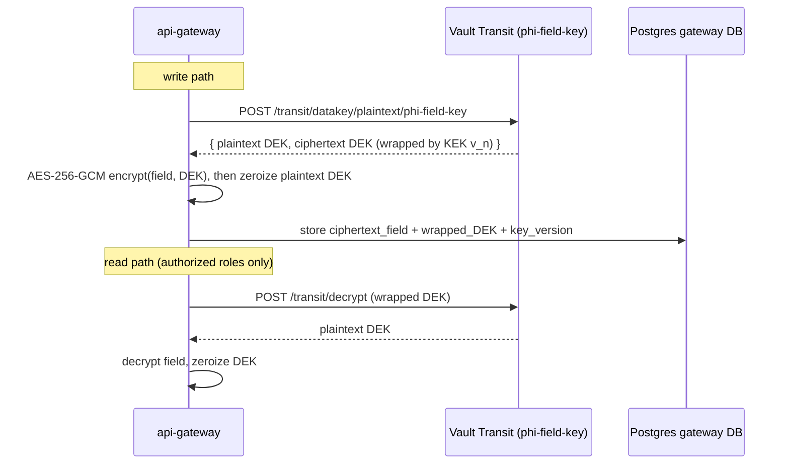

# MedFlow Compliance Posture — HIPAA-Style Gap Analysis

> **Scope statement.** MedFlow processes only **synthetic data** (Synthea, simulated HL7v2/DICOM/
> vitals, NIH ChestX-ray14 under its research-use-only license). It is **not** a covered entity or
> business associate, and no BAA exists. This document treats the platform *as if* it handled real
> PHI: each section maps a HIPAA Security Rule requirement to what is actually implemented, and the
> final section is an honest accounting of what a real production posture would still need.
> Dev-mode shortcuts in `docker-compose.yml` (plaintext Kafka, Vault dev root token, shared MinIO
> root credentials, `admin/admin` UIs) are explicitly **not** the production design — see
> [deployment.md](deployment.md) for the per-environment secrets story.

Companion artifacts: [`compliance/threat-model.md`](../compliance/threat-model.md),
[`compliance/access-policies/`](../compliance/access-policies/README.md),
[`compliance/audit-queries/`](../compliance/audit-queries/README.md),
[`compliance/deid-rules/`](../compliance/deid-rules/README.md).

---

## 1. PHI inventory — §164.308(a)(1)(ii)(A) input

You cannot protect what you have not enumerated. Every store that would hold PHI if the data were
real, what form it is in, and who can reach it:

| Data element | Store(s) | Form | Access path |
|---|---|---|---|
| Patient demographics (name, DOB, sex, address) | Postgres `fhir` (HAPI), Delta bronze/silver, OMOP gold (`person`) | Cleartext in FHIR; **de-identified in silver/gold consumed by analysts** (date-shifted, ZIP3) | FHIR proxy via api-gateway (scope + ABAC); Trino via gateway cohort API |
| Phone, email | Postgres `gateway` contact tables | **Encrypted** (Vault Transit envelope, key `phi-field-key`); also present cleartext inside FHIR `Patient.telecom` | Gateway decrypts per-request only for roles holding `phi:contact`; FHIR proxy masks `telecom` otherwise |
| MRN / identifiers | Postgres `fhir`, `hl7.raw` topic, Mongo raw-message archive, bronze | Cleartext (operational); **pseudonymized** (HMAC surrogate) in silver/gold | FHIR proxy; raw stores are infra-only (no user-facing path) |
| Encounters, conditions, meds, procedures | Postgres `fhir`, bronze/silver, OMOP gold | Cleartext operational; de-identified analytical | FHIR proxy; Trino |
| Vitals / device telemetry | MQTT in flight, `vitals.raw` topic, Postgres `vitals`, Flink state, bronze | Cleartext, keyed by patient ID | realtime-gateway (ABAC-filtered rooms); gateway REST |
| HL7v2 raw messages (all segments incl. PID/NK1/IN1) | `hl7.raw` topic (7d), MongoDB archive, `bronze.hl7_messages` | Cleartext | No user-facing path; infra/break-glass only |
| DICOM studies (pixel data + headers incl. PatientName/ID tags) | MinIO `imaging` bucket | Cleartext objects (KMS-at-rest in AWS) | Cornerstone viewer via gateway-signed URLs; DICOM SCP write-only |
| ImagingStudy metadata | Postgres `fhir`, `dicom.received` topic, bronze manifests | Cleartext | FHIR proxy |
| Clinical notes / NLP output | Postgres `fhir` (DocumentReference), OpenSearch index | Cleartext in FHIR; **de-identified before OpenSearch indexing** (Presidio) | Cohort builder text search (de-id only); FHIR proxy for source note |
| ML features | Feast offline (Delta), Feast online (Redis) | Pseudonymized patient key; feature values are clinical data | ml-serving service account only |
| Predictions + explanations | Postgres `predictions`, `predictions` topic, MLflow artifacts | Pseudonymized key + scores; SHAP/Grad-CAM artifacts may embed clinical values/pixels | Dashboard model views via gateway; MLflow infra-only |
| Audit log (who saw whom — itself sensitive) | Postgres `audit` (`audit_log`), `audit.events` topic, MinIO `audit-worm` | Cleartext, hash-chained; WORM copy object-locked | audit-service API (auditor role); SQL via [`compliance/audit-queries/`](../compliance/audit-queries/) |
| Logs / traces / metrics | Loki, Tempo, Prometheus | **Must contain no PHI** (see §10 logging policy); resource IDs only | Grafana (operator role) |
| Backups | Postgres WAL/base backups, MinIO replication (AWS: RDS snapshots, S3 versioning) | Encrypted at rest (KMS) | Restore procedure only ([runbook](runbooks/restore-drill.md)) |

Notable inventory decisions:

- **Kafka holds cleartext PHI for ≤7 days** (topic retention). In AWS the brokers are inside the
  mesh (mTLS) with encrypted EBS; locally they are plaintext — acceptable only because the data is
  synthetic. This is the largest single divergence between dev and the intended posture.
- **Two analytical identities**: silver/gold use an HMAC-pseudonymized patient key; re-identification
  requires the keyed mapping, which lives only in the de-id service's domain. Analysts on Trino
  never see direct identifiers.

## 2. Encryption — §164.312(a)(2)(iv) (at rest), §164.312(e)(1) (transmission security)

### 2.1 In transit

- **Production (K8s):** Istio `PeerAuthentication` mode `STRICT` — every pod-to-pod hop, including
  service→Kafka, service→Postgres, Flink→ml-serving, is mutually-authenticated TLS 1.3 with
  SPIFFE workload identities and automatic cert rotation (24h default). No service accepts
  plaintext from inside the cluster.
- **Edge:** AWS ALB/WAF terminates TLS 1.3/1.2 (TLS 1.3 preferred policy), re-encrypts to the
  Istio ingress gateway.
- **Special protocols:** MLLP (:2575) and DICOM DIMSE (:11112) are legacy-plaintext protocols by
  default. They ride the mesh inside the cluster; cross-site senders must connect through a
  TLS-wrapped tunnel (stunnel/IPsec) or DICOM TLS — documented as a deployment requirement, not
  optional. MQTT from devices: TLS with per-device client certificates at the broker.
- **Local compose:** plaintext everywhere — dev-only, synthetic data.

### 2.2 Field-level encryption: Vault Transit envelope design

The gateway encrypts `phone` and `email` columns (the high-sensitivity, low-query-need contact
fields) with **envelope encryption** against Vault's Transit engine
(bootstrapped by `infra/vault/bootstrap-transit.sh`, key name `phi-field-key`):



- **KEK** (`phi-field-key`) never leaves Vault. The gateway's Vault policy
  ([`compliance/access-policies/vault-policy-gateway.hcl`](../compliance/access-policies/vault-policy-gateway.hcl))
  permits exactly `encrypt`/`decrypt`/`datakey` on that one key — no key export, no key admin,
  no other paths.
- **Rotation:** `vault write -f transit/keys/phi-field-key/rotate` is cheap because only DEK
  wrappers reference the KEK version; a background rewrap job calls `transit/rewrap` so old rows
  migrate to the newest KEK version without touching field plaintext. `min_decryption_version`
  is raised after rewrap completes, retiring old versions.
- **Why envelope via Vault rather than pgcrypto or app-level static AES** (full reasoning in
  [ADR-0003](adr/0003-vault-envelope-encryption.md)):
  - pgcrypto puts the key in SQL text / DB memory — a DB compromise or a logged query leaks the
    key with the data; backups of the DB are self-decrypting for anyone who also gets the key
    from the same blast radius.
  - A static app-level key in env/config rotates only with a painful full re-encrypt and appears
    in every replica's environment.
  - Vault centralizes the KEK, gives per-use audit of every decrypt (Vault audit log + our own
    `audit.events`), versioned rotation, and immediate revocation by sealing or policy change.
  - Cost: Vault is a hard runtime dependency for those fields. Accepted: failure mode is
    "contact fields unavailable/masked", never "system down" (see failure table in
    [architecture.md](architecture.md#6-failure-modes-by-layer)).

### 2.3 At rest

| Store | Mechanism |
|---|---|
| AWS RDS Postgres | KMS-encrypted storage + snapshots, CMK per environment |
| S3 (lakehouse, imaging, audit-worm) | SSE-KMS with bucket keys; audit-worm additionally Object Lock compliance mode |
| EBS (Kafka, OpenSearch, Redis nodes) | KMS-encrypted volumes |
| MinIO (local) | none — dev-only |
| Field-level (phone/email) | Vault Transit envelope as above, **in addition to** storage encryption — defense against DB-level read access, not just disk theft |

## 3. Access control — §164.312(a)(1), §164.312(d) (person/entity authentication), §164.308(a)(4)

### 3.1 Authentication

OAuth2/OIDC at the api-gateway (dev: self-issued; production: enterprise IdP federation), JWTs
verified by both gateways. Tokens carry `sub`, `role`, SMART scopes, and care-team attribute
claims. Service-to-service identity is Istio mTLS (SPIFFE), not shared secrets.

### 3.2 RBAC roles

| Role | Intended user | Can | Cannot |
|---|---|---|---|
| `clinician` | treating staff | read/write FHIR for **care-team patients**, see alerts, acknowledge | see non-care-team patients without break-glass; export bulk data |
| `nurse` | unit nursing | as clinician, scoped to assigned unit | modify orders |
| `patient` | portal user | read **own** record (`patient/*.read`), own audit disclosures | anything cross-patient |
| `researcher` | cohort analysts | Trino/OMOP queries over **de-identified** gold only | any cleartext PHI path; FHIR proxy |
| `ml-engineer` | model ops | MLflow registry, drift reports, predictions metadata | patient-level clinical reads |
| `auditor` | compliance | audit-service API, audit explorer, WORM bucket read | any clinical write; cannot write audit rows |
| `admin` | platform ops | service config, user admin | unaudited PHI reads — admin PHI access still flows through the gateway and is audited like everyone else's |

### 3.3 ABAC on top of RBAC

Role alone never grants patient-record access. The gateway evaluates attributes per request:

- `care_team`: requester ∈ CareTeam of the target patient (derived from FHIR `CareTeam` and
  encounter assignments, cached with short TTL).
- `unit`: nurse's assigned unit matches patient's current location (PV1-3-derived).
- `purpose_of_use`: claims-asserted; `TREATMENT` required for cleartext clinical reads.
- `break_glass`: temporary elevation flag (below).

### 3.4 SMART on FHIR scope mapping

| SMART scope | Gateway enforcement |
|---|---|
| `patient/*.read` | FHIR proxy compartment-restricts every query to the token's patient (`Patient/<id>` compartment); portal default |
| `user/Observation.read` | clinician may read Observations for ABAC-permitted patients |
| `user/*.write` | conditional writes via proxy, audit `action=write` |
| `phi:contact` (custom) | unmasks `Patient.telecom` + triggers Vault decrypt of contact columns |
| `system/*.read` (backend services) | client-credentials flow for batch exports; per-client rate limits + allowlisted resource types |

The proxy performs **scope narrowing**: a downstream request never carries broader scopes than
the minimum the route needs, so a compromised downstream call cannot replay an over-scoped token.

### 3.5 Break-glass — §164.312(a)(2)(ii) emergency access procedure

1. Clinician requests elevation on a specific patient; UI **requires a free-text justification**.
2. Gateway issues a 1-hour elevation grant (patient-scoped, not global), recorded as audit action
   `BREAK_GLASS_OPEN` with the justification in `audit_log.justification`.
3. Every request made under elevation is audited with the elevation ID; masking is relaxed only
   for that patient.
4. Expiry is automatic at 60 minutes; `BREAK_GLASS_CLOSE` is recorded.
5. **Review:** every break-glass event is human-reviewed within 7 days using
   [`break-glass-review.sql`](../compliance/audit-queries/break-glass-review.sql); unreviewed
   events older than 7 days alarm in Grafana.

## 4. Audit controls — §164.312(b); documentation retention §164.316(b)(2)(i)

### 4.1 Chain design

`audit_log` (DDL in `infra/docker/postgres/init-audit.sql`) is append-only and hash-chained:

```
hash_n = sha256( ts_n || actor_id_n || action_n || resource_type_n || resource_id_n || hash_{n-1} )
```

- Row 1 chains from a published genesis value.
- Postgres triggers (`audit_log_no_update`, `audit_log_no_truncate`) raise on UPDATE, DELETE, and
  TRUNCATE **for every role including the table owner** — tampering requires DDL (dropping the
  trigger), which is itself visible in Postgres logs and breaks the chain anyway.
- Columns captured: `ts, actor_id, actor_role, action, resource_type, resource_id, ip,
  user_agent, justification, hash, prev_hash` — enough to answer "who, what, when, from where,
  why" without storing clinical content in the audit store.

### 4.2 Tamper-evidence math (and its limits)

- Modifying any field of row *k* changes `hash_k`; row *k+1* stored `prev_hash = old hash_k`, so
  recomputation mismatches at *k+1*. Detecting any in-place edit therefore costs one linear scan
  ([`chain-verification.sql`](../compliance/audit-queries/chain-verification.sql) does it in pure
  SQL with a window function).
- An attacker with full DB write access could **rewrite the entire suffix** of the chain
  consistently. That is why the chain alone is necessary but not sufficient: the daily
  **WORM export** anchors the chain externally. Each day's export (JSONL.gz of that day's rows
  plus the day's terminal hash) goes to the `audit-worm` MinIO/S3 bucket created **with object
  lock, compliance mode, 2190-day (6-year) default retention** (`infra/docker/minio/create-buckets.sh`).
  Compliance-mode locks cannot be shortened or removed, even by the root account.
- A suffix-rewrite attack is therefore detectable by comparing today's recomputed chain against
  any previously exported terminal hash. Verification window of exposure: at most 24h (the export
  cadence). Residual gap: an attacker controlling both the DB **and** able to intercept the export
  job on day 0 — mitigated by alerting if the export is late and by the export job's separate
  credentials (write-once, no delete, per bucket policy).
- The 6-year retention satisfies §164.316(b)(2)(i)'s six-year documentation retention requirement
  applied to audit artifacts.

### 4.3 What gets audited

Every api-gateway request (interceptor), FHIR proxy reads with resource IDs, break-glass open/
close, alert deliveries, de-identification jobs, model promotions, Vault decrypt operations
(via Vault's own audit device, cross-referenced), and admin actions. Patients can view
disclosures of their own record in the portal (a HIPAA "accounting of disclosures" gesture,
§164.528 — partial, see gaps).

### 4.4 Review procedures — §164.308(a)(1)(ii)(D) information system activity review

| Review | Cadence | Query |
|---|---|---|
| Chain integrity | daily (automated, `make compliance-report`) + on-demand | [`chain-verification.sql`](../compliance/audit-queries/chain-verification.sql) |
| Break-glass events | within 7 days of event | [`break-glass-review.sql`](../compliance/audit-queries/break-glass-review.sql) |
| After-hours access | weekly | [`after-hours-access.sql`](../compliance/audit-queries/after-hours-access.sql) |
| Bulk-read anomalies (snooping/exfil patterns) | weekly | [`bulk-read-anomaly.sql`](../compliance/audit-queries/bulk-read-anomaly.sql) |
| Per-patient access report (complaint-driven) | on demand | [`who-accessed-patient.sql`](../compliance/audit-queries/who-accessed-patient.sql) |
| De-identification activity | monthly | [`deid-activity.sql`](../compliance/audit-queries/deid-activity.sql) |

## 5. De-identification — §164.514(b)

Implemented method: **Safe Harbor**, §164.514(b)(2), via the Presidio-based deid-service (:8093).
Full per-identifier mapping in
[`compliance/deid-rules/safe-harbor-checklist.md`](../compliance/deid-rules/safe-harbor-checklist.md);
recognizer catalog in [`compliance/deid-rules/README.md`](../compliance/deid-rules/README.md).
Highlights:

- **Dates** → HMAC-per-patient shift, uniform ±1–365 days, keyed by `DATE_SHIFT_SECRET`. The
  shift is constant per patient, so **intervals are preserved** (length of stay, time-to-event
  survive de-identification) while absolute dates do not. Year is retained per Safe Harbor.
- **ZIP** → first 3 digits retained; ZIP3 areas with ≤20,000 population (the published restricted
  list) zeroed to `000`.
- **Ages ≥ 90** → aggregated to a `90+` category.
- **Free text** → Presidio recognizers (names, MRN patterns, phones, emails, URLs, IPs, device
  IDs) with clinical allow-lists to avoid destroying drug/anatomy terms.

**Expert determination (§164.514(b)(1)) alternative.** Safe Harbor is mechanical and auditable
but blunt — it forbids dates and small-area geography that research often needs. An expert
determination could certify a richer dataset (e.g., exact event dates with k-anonymity ≥ a
threshold over quasi-identifiers, l-diversity on diagnoses) at the cost of engaging a qualified
statistician and re-certifying when the data or threat landscape changes. The deid-service's
configuration-driven rules were designed so an expert-determined profile could ship as an
alternate ruleset without code changes. Not implemented; listed in the gap table.

**Residual risk statement (honest).** Safe Harbor does not guarantee non-re-identifiability:
rare diagnosis + ZIP3 + year combinations, free-text recognizer misses (Presidio recall on
clinical text is not 100%), waveform/vitals fingerprinting, and DICOM burned-in pixel annotations
(we strip header tags; OCR of burned-in text is **not** implemented) all remain plausible vectors.
The pseudonymization HMAC key and date-shift secret are single points of re-identification and
are managed accordingly (Vault, no analyst access). Synthetic data makes this risk moot today;
it would head the risk register with real data.

## 6. Minimum necessary — §164.502(b), §164.514(d)

- The FHIR proxy applies **field-level masking by scope**: without `phi:contact`,
  `Patient.telecom` is removed; without treatment purpose-of-use, narrative text and notes are
  withheld; researcher tokens cannot reach the proxy at all (de-identified Trino path only).
- Scope narrowing ensures internal calls carry minimum scopes.
- The dashboards request the narrowest scopes that render the page; the worklist shows scores and
  bed numbers, not full demographics, until a chart is opened (an auditable event).
- Patients see only their own compartment.

## 7. Vulnerability management — §164.308(a)(1)(ii)(B), §164.308(a)(8)

| Control | Implementation |
|---|---|
| Image scanning gate | `make scan` (`scripts/scan.sh`): Trivy on every service image, **fails CI on HIGH/CRITICAL**; base images pinned by digest |
| SBOM | `make sbom`: Syft SPDX SBOMs per image, attached as OCI artifacts |
| Continuous re-scan | weekly Grype run of *deployed* SBOMs — catches CVEs published after build without rebuilding |
| Signing | Cosign keyless signing in CI; **Kyverno/policy-controller `verify-before-deploy`** in K8s admission rejects unsigned or unattested images |
| Dependency hygiene | lockfiles (pnpm, uv/pip pins), Renovate-style bumps batched weekly |
| Pen test | not performed — gap table |

## 8. Runtime security — Falco

Falco rules tuned to this stack's actual attack surface, each with a rationale:

| Rule | Why |
|---|---|
| Shell spawned in any `apps/*` container | services are distroless-ish; an interactive shell is post-exploitation, not ops |
| Outbound connection from ml-serving to non-(MLflow, Redis, Postgres, OTel) destinations | model-loading code paths (pickle/torch load) are a classic RCE→exfil vector; egress is otherwise fixed |
| Write to `/` outside expected paths in fhir-server / gateway | JVM/Node images are read-only-rootfs; any write is anomalous |
| Read of Vault token files by non-gateway/deid processes | token theft is the pivot to PHI field decryption |
| `kubectl exec` into prod namespaces | allowed only via the break-glass-ops procedure; every exec pages the on-call |
| Postgres process executing `DROP TRIGGER`/`ALTER TABLE` on `audit` DB | the only DDL path that could silence the append-only triggers (see audit-chain runbook) |

Falco alerts route to the same alerting path as Prometheus (severity-tagged), and security-class
alerts also append to `audit.events`.

## 9. Backup & disaster recovery — §164.308(a)(7), §164.310(d)(2)(iv)

| Target | RPO | RTO | Mechanism |
|---|---|---|---|
| Postgres (fhir, audit, gateway, vitals, predictions) | **15 min** | **4 h** | WAL archiving + PITR (AWS: RDS automated backups, 15-min log shipping) |
| MinIO/S3 lakehouse + imaging | 15 min (versioning is continuous) | 4 h | S3 versioning + cross-region replication; Delta time travel for logical corruption |
| audit-worm | 0 (object lock, replicated) | n/a (read-only) | compliance-mode lock + CRR |
| Kafka | not backed up | n/a | by design: 7-day buffer; sources of truth are Postgres + lake |
| Vault | 24 h (snapshot) | 4 h | integrated storage snapshots; KEK loss = contact-field loss only (documented, accepted) |
| MLflow registry | 24 h | 8 h | Postgres backup + artifact bucket versioning |

- **Restore drills** are quarterly and follow [runbooks/restore-drill.md](runbooks/restore-drill.md);
  the drill is not "did the snapshot restore" but "does the restored FHIR server pass smoke tests
  and does the audit chain verify across the restore point".
- Logical-corruption recovery (bad deploy writes garbage) is distinct from infrastructure loss:
  Delta time travel + PITR give point-in-time options for both.

## 10. Logging policy

**Never logged, enforced by serializer-level redaction in every service + Loki drop rules as
backstop:**

- patient names, DOBs, addresses, telecoms, MRNs (resource **IDs** are allowed — they are opaque
  references that require an authorized FHIR call to resolve)
- HL7v2 message bodies (control IDs only), DICOM patient tags, free-text clinical content
- JWTs, Vault tokens, DEKs, `DATE_SHIFT_SECRET`-derived values, S3 keys
- request bodies on PHI routes (method, route template, status, latency only)

Retention: Loki 30 days, Tempo 14 days, Prometheus 90 days (downsampled). The **audit log is the
long-term record, not application logs** — that separation is what makes short log retention
defensible. Structured-log linting in CI greps for forbidden field names in log statements.

## 11. Gaps & roadmap — the honest table

What a genuine HIPAA production posture still requires. "Effort" assumes one senior engineer
unless noted.

| # | Gap | HIPAA reference | Why it matters | Effort |
|---|---|---|---|---|
| 1 | **Formal risk analysis** (documented, asset-by-asset, threat × likelihood × impact, reviewed annually) | §164.308(a)(1)(ii)(A) | The Security Rule's foundation; OCR's first document request in any investigation. The threat model is an input, not a substitute. | 3–4 wk + annual refresh |
| 2 | **BAAs** with every vendor touching PHI (cloud, monitoring SaaS, paging) | §164.308(b), §164.314(a) | Without BAAs, disclosure to vendors is itself a violation | 2–3 wk legal + inventory |
| 3 | **Workforce security & training program** (role-based training, sanctions policy, termination procedures) | §164.308(a)(3), (a)(5) | Most breaches are people, not crypto | 2 wk to stand up + ongoing |
| 4 | **Contingency plan testing** (documented DR tests, criticality analysis, emergency-mode operation plan) | §164.308(a)(7)(ii)(D) | A restore drill runbook ≠ a tested org-level contingency plan | 2 wk + quarterly exercises |
| 5 | **Incident response plan + tabletops** (roles, breach-notification clock per §164.404 60-day rule, evidence handling) | §164.308(a)(6) | The audit-chain runbook covers one scenario; an IR program covers the class | 3 wk + 2 tabletops/yr |
| 6 | **External penetration test** + remediation cycle | §164.308(a)(8) evaluation | Self-assessment bias; auth/ABAC logic is exactly where pen testers find holes | 2–4 wk vendor + 2 wk fixes |
| 7 | **Expert determination de-id option** for research datasets | §164.514(b)(1) | Safe Harbor destroys research utility (dates); expert path is the standard answer | 4–6 wk incl. statistician |
| 8 | **Full accounting of disclosures** (beyond own-record view: TPO exclusions, 60-day response workflow) | §164.528 | Patient right; current portal view is a subset | 3 wk |
| 9 | **DICOM burned-in annotation handling** (OCR detection / pixel redaction) | §164.514(b)(2)(i)(Q–R) | Header scrubbing misses pixel-embedded PHI | 3–4 wk |
| 10 | **Kafka TLS/SASL + ACLs everywhere incl. local parity** | §164.312(e)(1) | Largest in-cluster cleartext surface today | 1–2 wk |
| 11 | **HITRUST e1/i1 or SOC 2 Type II** attestation | market requirement, not HIPAA per se | Customers/partners will demand third-party attestation | 3–6 mo program (team) |
| 12 | **Physical safeguards documentation** (facility access, workstation use policies — mostly inherited from AWS but must be documented as such) | §164.310 | Inheritance must be written down to count | 1 wk |
| 13 | **Vault production hardening** (auto-unseal via KMS, HA, audit device shipping, no root token) | §164.312(a)(2)(iv) | Dev mode Vault is a toy; the design assumes the hardened version | 1–2 wk |
| 14 | **Data retention/destruction policy** for clinical data (beyond audit's 6y) | §164.310(d)(2)(i) | Disposal is a named safeguard | 1 wk policy + lifecycle rules |

**Reading the table honestly:** items 1–5 are organizational, not code — they are why "HIPAA
compliance" is a property of an organization running software, never of software alone. MedFlow's
claim is narrower and defensible: the *technical safeguards* (§164.312 family) are implemented or
have a designed, costed path, and the administrative gaps are enumerated rather than hand-waved.
