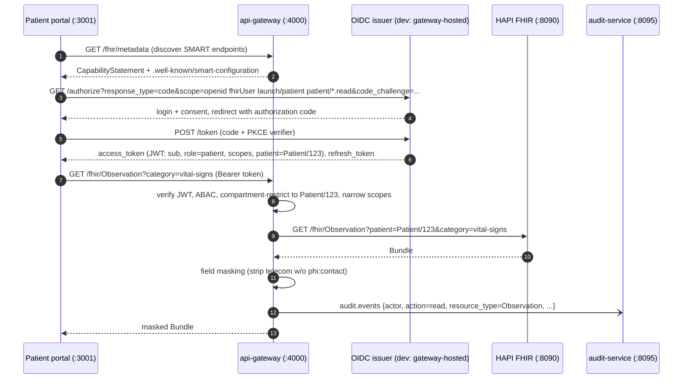

# MedFlow Interoperability Reference

> Companion to [architecture.md](architecture.md) §2.2 (interop layer) and §3.2 (HL7→OMOP
> narrative). This document is the field-level reference: which FHIR resources we touch and how,
> the SMART on FHIR launch the gateway implements, the HL7v2→FHIR mapping tables the
> hl7v2-ingester executes, MLLP framing/ACK semantics, the DICOM C-STORE flow with the exact tag
> handling policy, and worked CDS Hooks request/response examples.

---

## 1. FHIR resources and interactions

HAPI FHIR R4 (:8090, base `/fhir`) is the operational source of truth. The table lists every
resource type MedFlow reads or writes, who touches it, and which FHIR interactions are used.
Anything not listed is reachable on the server (HAPI is unrestricted at the server level — the
**gateway proxy** is the enforcement point) but unused.

| Resource | Producer(s) | Consumer(s) | Interactions used | Notes |
|---|---|---|---|---|
| `Patient` | Synthea seed, hl7v2-ingester (PID) | gateway proxy, dashboards, lakehouse | `create` (bundle), conditional `update` on MRN identifier, `read`, `search` | telecom masked by proxy without `phi:contact` |
| `Encounter` | Synthea, hl7v2-ingester (PV1) | gateway, lakehouse, CDS `encounter-discharge` | conditional `update` on visit-number identifier, `read`, `search` | A03 sets `status=finished` + period.end |
| `Observation` | Synthea, hl7v2-ingester (OBX), wearables backfill | Flink features (via lakehouse), dashboards | `create`, `search` (`patient`, `code`, `date`) | LOINC-coded; vitals hot path bypasses FHIR (Kafka) |
| `ServiceRequest` | hl7v2-ingester (ORC/OBR) | dashboards (order context) | conditional `create` on placer/filler IDs, `read` | |
| `ImagingStudy` | dicom-receiver | dashboard viewer, lakehouse manifests | conditional `update` on StudyInstanceUID identifier | endpoint points at gateway-signed MinIO URLs |
| `DiagnosticReport` | Synthea | dashboards | `read`, `search` | |
| `Condition`, `MedicationRequest`, `Procedure`, `AllergyIntolerance`, `Immunization` | Synthea | dashboards, OMOP mapping | `read`, `search` | mapped to OMOP domains in `silver_to_omop` |
| `CareTeam` | Synthea + admin UI | **gateway ABAC** (care-team attribute), realtime-gateway room filtering | `read`, `search`, `update` | the security-relevant resource; cached with short TTL |
| `DocumentReference` | Synthea (notes) | medspaCy pipeline, deid-service → OpenSearch | `read`, `search` | de-identified before any index |
| `Bundle` (transaction) | Synthea seed | — | `transaction` POST to base | seed path only |

Server-level capabilities used: conditional create (`If-None-Exist`), conditional update by
identifier (the idempotency mechanism for replayed HL7), `_lastUpdated` searches (lakehouse
reconciliation), and the change interceptor that emits to `fhir.changes` (see
[architecture.md](architecture.md#23-kafka)). We deliberately do **not** use FHIR Subscriptions
(the interceptor→Kafka path is the subscription mechanism) or `$everything` from clients (the
proxy compartment-restricts instead).

## 2. SMART on FHIR launch sequence

The gateway (:4000) is both the OAuth2/OIDC authorization surface (dev: self-issued) and the FHIR
proxy. Standalone launch for the patient portal (`patient/*.read`); the clinician dashboard uses
the same sequence with `user/*` scopes plus care-team claims.



Key enforcement points (full rationale in [compliance.md](compliance.md#34-smart-on-fhir-scope-mapping)
and [ADR-0005](adr/0005-smart-on-fhir-vs-custom-oauth.md)):

- **PKCE required** for both public clients (portal, mobile); no implicit flow.
- The `patient` token claim drives **compartment restriction** — the proxy rewrites every search
  to include the compartment, so even a crafted query cannot escape it.
- **Scope narrowing**: the proxy forwards the minimum scopes the route needs downstream.
- Every proxied call produces an `audit.events` record before the response is returned to the
  client (the audit write itself is async; the *enqueue* is on-path).

## 3. HL7v2 → FHIR mapping

Executed by `apps/hl7v2-ingester`. Raw-before-map invariant: the verbatim message is durably in
`hl7.raw` (key = MSH-10) **before** any mapping runs and before the MLLP ACK is sent. Mapping
failures therefore never lose data — they park the message for replay.

Message types handled: `ADT^A01` (admit), `A04` (register), `A08` (update), `A03` (discharge),
`ORU^R01` (results), `ORM^O01` (orders). Anything else gets an `AR` (application reject) with the
unsupported-type error in MSA-3, and the raw copy is still archived.

### 3.1 PID → Patient

| HL7 field | Meaning | FHIR target | Transform |
|---|---|---|---|
| PID-3 | Patient identifier list | `Patient.identifier[]` | each repetition → identifier; CX.5 type code → `identifier.type` (MR→MRN system `urn:medflow:mrn`); MRN is the conditional-update key |
| PID-5 | Patient name | `Patient.name[official]` | XPN.1→family, XPN.2→given[0], XPN.3→given[1]; XPN.7 name-type `L`→`official` |
| PID-7 | Date/time of birth | `Patient.birthDate` | `YYYYMMDD` → ISO date; time component dropped |
| PID-8 | Administrative sex | `Patient.gender` | `M`→`male`, `F`→`female`, `O`→`other`, `U`/empty→`unknown` |
| PID-11 | Patient address | `Patient.address[]` | XAD.1→line[0], XAD.2→line[1], XAD.3→city, XAD.4→state, XAD.5→postalCode, XAD.6→country |
| PID-13 | Phone (home) | `Patient.telecom[]` | XTN → `{system: phone, use: home}`; normalized to E.164 when parseable |
| PID-14 | Phone (business) | `Patient.telecom[]` | `{system: phone, use: work}`; XTN.4 email → `{system: email}` |
| PID-15 | Primary language | `Patient.communication.language` | table 0296 → BCP-47 best effort, else original code preserved |
| PID-16 | Marital status | `Patient.maritalStatus` | table 0002 → `http://terminology.hl7.org/CodeSystem/v3-MaritalStatus` |
| PID-29/30 | Death date/indicator | `Patient.deceasedDateTime` / `deceasedBoolean` | PID-29 wins when both present |

Not mapped (deliberately): PID-19 (SSN — never persisted, scrubbed even from the *parsed*
representation; the raw archive retains it under the raw-store access policy in
[compliance.md](compliance.md#1-phi-inventory--164308a1iia-input)), PID-10 (race) and PID-22
(ethnicity) are mapped only to the US Core extensions when present and valid, else dropped.

### 3.2 PV1 → Encounter

| HL7 field | Meaning | FHIR target | Transform |
|---|---|---|---|
| PV1-2 | Patient class | `Encounter.class` | `I`→`IMP`, `O`→`AMB`, `E`→`EMER`, `P`→`PRENC` (v3-ActCode) |
| PV1-3 | Assigned location | `Encounter.location[].location` | PL components → Location display `point-of-care / room / bed`; also feeds the nurse `unit` ABAC attribute |
| PV1-7 | Attending doctor | `Encounter.participant[ATND]` | XCN → Practitioner reference (conditional on NPI identifier) |
| PV1-10 | Hospital service | `Encounter.serviceType` | table 0069 code preserved |
| PV1-14 | Admit source | `Encounter.hospitalization.admitSource` | table 0023 → FHIR admit-source |
| PV1-19 | Visit number | `Encounter.identifier[VN]` | conditional-update key (`urn:medflow:visit-number`) |
| PV1-36 | Discharge disposition | `Encounter.hospitalization.dischargeDisposition` | table 0112 code preserved |
| PV1-44 | Admit date/time | `Encounter.period.start` | HL7 TS → ISO instant (facility TZ) |
| PV1-45 | Discharge date/time | `Encounter.period.end` | set by A03; also flips `status` → `finished` |
| (trigger) | Event type | `Encounter.status` | A01/A04 → `in-progress`, A03 → `finished`, A08 → unchanged |

### 3.3 OBX → Observation (within ORU^R01)

One `Observation` per OBX segment; OBR context provides grouping (a `DiagnosticReport` is created
per OBR when ≥1 OBX maps successfully).

| HL7 field | Meaning | FHIR target | Transform |
|---|---|---|---|
| OBX-2 | Value type | controls `value[x]` | `NM`→`valueQuantity`, `ST`/`TX`→`valueString`, `CE`/`CWE`→`valueCodeableConcept`, `SN`→`valueQuantity` with comparator |
| OBX-3 | Observation identifier | `Observation.code` | CE → LOINC when system is `LN`; local codes carried with original system + mapped via concept-map table when known |
| OBX-5 | Value | `value[x]` | per OBX-2 |
| OBX-6 | Units | `valueQuantity.unit/code` | UCUM passthrough when valid; non-UCUM units mapped via unit table, else `unit` set and `code` omitted |
| OBX-7 | Reference range | `Observation.referenceRange` | `low-high` text parsed; unparseable → `referenceRange.text` |
| OBX-8 | Abnormal flags | `Observation.interpretation` | table 0078 → v3-ObservationInterpretation |
| OBX-11 | Result status | `Observation.status` | `F`→`final`, `P`→`preliminary`, `C`→`corrected` (conditional update of prior), `X`→`cancelled` |
| OBX-14 | Observation date/time | `Observation.effectiveDateTime` | HL7 TS → ISO |
| OBR-3 + OBX-1 | Filler order + set ID | `Observation.identifier` | composite idempotency key for replays |

### 3.4 ORC/OBR → ServiceRequest (ORM^O01)

| HL7 field | Meaning | FHIR target | Transform |
|---|---|---|---|
| ORC-1 | Order control | `ServiceRequest.status`/`intent` | `NW`→`active`/`order`, `CA`→`revoked`, `DC`→`completed`, `HD`→`on-hold` |
| ORC-2 / OBR-2 | Placer order number | `ServiceRequest.identifier[PLAC]` | conditional-create key |
| ORC-3 / OBR-3 | Filler order number | `ServiceRequest.identifier[FILL]` | |
| ORC-9 | Transaction date/time | `ServiceRequest.authoredOn` | |
| ORC-12 / OBR-16 | Ordering provider | `ServiceRequest.requester` | XCN → Practitioner (conditional on NPI) |
| OBR-4 | Universal service ID | `ServiceRequest.code` | CE → LOINC/CPT passthrough with original system |
| OBR-5 | Priority | `ServiceRequest.priority` | `S`→`stat`, `A`→`asap`, `R`/empty→`routine` |
| OBR-7 | Observation date/time | `ServiceRequest.occurrenceDateTime` | |

## 4. MLLP framing and ACK semantics

Framing (the ingester accepts nothing else; bytes outside a frame are discarded with a metric):

```
<VT=0x0B> message bytes (\r segment separators) <FS=0x1C> <CR=0x0D>
```

ACK decision tree — the load-bearing rule is **ACK after durable archive, not after mapping**:

| Condition | ACK code (MSA-1) | Sender behavior |
|---|---|---|
| Raw message produced to `hl7.raw` and Kafka ack received | `AA` (accept) | proceed; mapping happens async after this point |
| Kafka unavailable / produce timeout | `AE` (error) | retry with backoff — message is **not** archived, so we must not accept it |
| Unparseable MSH (can't even extract MSH-10) | `AE` | retry/repair; nothing to key the archive on |
| Parseable but unsupported message type | `AR` (reject) after raw archive | do not retry; raw copy retained for analysis |
| Accept queue full (flood) | TCP backpressure, then `AE` | MLLP-native flow control; see failure table in [architecture.md](architecture.md#6-failure-modes-by-layer) |

Consequence: a mapping bug yields `AA` + a parked message (replayed from `hl7.raw` after the fix),
never a NAK storm at the sender and never data loss. This is the same raw-before-map argument made
in [architecture.md](architecture.md#32-an-hl7-adt-messages-journey-to-omop).

The ACK echoes MSH-10 into MSA-2 and swaps sending/receiving facility fields per the HL7v2 spec.
One message per MLLP frame; the ingester supports persistent connections and processes frames
sequentially per connection.

## 5. DICOM C-STORE flow and tag policy

`apps/dicom-receiver` is a pynetdicom Storage SCP, AE title `MEDFLOW`, DIMSE on :11112. Accepted
presentation contexts: the storage SOP classes for CR/DX/CT/MR plus Secondary Capture, with
Implicit/Explicit VR Little Endian and JPEG-family transfer syntaxes (others rejected at
association negotiation, not mid-transfer).

Per C-STORE request:

1. **Validate** SOP Class/Instance UIDs and that PatientID resolves (or is creatable) — failures
   return DIMSE status `0xA900` (dataset mismatch) / `0xC000` (processing failure); the sender's
   SCU retry logic owns redelivery.
2. **Write the instance to MinIO `imaging`** at
   `studies/{StudyInstanceUID}/{SeriesInstanceUID}/{SOPInstanceUID}.dcm`. Object write is fsynced
   before step 3 — same durability-before-acknowledge stance as MLLP.
3. **Upsert FHIR `ImagingStudy`** (conditional on StudyInstanceUID identifier), adding the
   series/instance entries and the Patient link.
4. **Emit manifest event** to `dicom.received` (study/series/instance UIDs + object keys; never
   pixel data — see [architecture.md](architecture.md#22-interop-layer)).
5. Return DIMSE `0x0000` (success).

A C-STORE is per-instance, so an SCP crash mid-study leaves a partial study; the hourly
`dicom_manifest_to_bronze` reconciliation flags studies whose instance count in MinIO disagrees
with the ImagingStudy resource.

### Tag policy

| Tag | Name | Read? | Persisted where | Logged? |
|---|---|---|---|---|
| (0010,0020) | PatientID | yes | FHIR link, MinIO object (in file) | **never** |
| (0010,0010) | PatientName | yes (identity cross-check only) | object only | **never** |
| (0010,0030) | PatientBirthDate | yes | object only | **never** |
| (0010,0040) | PatientSex | yes | ImagingStudy → Patient | **never** |
| (0020,000D) | StudyInstanceUID | yes | everywhere (the key) | yes — opaque UID |
| (0020,000E) | SeriesInstanceUID | yes | manifests, paths | yes |
| (0008,0018) | SOPInstanceUID | yes | manifests, paths | yes |
| (0008,0016) | SOPClassUID | yes | ImagingStudy.series.instance | yes |
| (0008,0060) | Modality | yes | ImagingStudy.series.modality | yes |
| (0008,0020/0030) | StudyDate/Time | yes | ImagingStudy.started | yes (date only) |
| (0008,1030) | StudyDescription | yes | ImagingStudy.description | no (free text can carry PHI) |
| (0008,0080/0090) | InstitutionName / ReferringPhysicianName | no (skipped) | object only | **never** |
| (7FE0,0010) | PixelData | not parsed beyond presence check | object only | **never** (size in bytes only) |

Rule of thumb enforced by `test_logging_phi.py`: log lines may contain **UIDs and counts, never
names, dates of birth, IDs, or descriptions**. Burned-in pixel annotations are an acknowledged
gap (item 9 in the [compliance gap table](compliance.md#11-gaps--roadmap--the-honest-table)).

## 6. CDS Hooks

cds-hooks-service (:8096) implements the CDS Hooks 1.1 discovery and service endpoints.

### 6.1 Discovery — `GET /cds-services`

```json
{
  "services": [
    {
      "hook": "patient-view",
      "id": "sepsis-warning",
      "title": "MedFlow Sepsis Early Warning",
      "description": "Surfaces the latest sepsis risk score (LSTM or NEWS2 fallback) for the patient in context.",
      "prefetch": {
        "patient": "Patient/{{context.patientId}}"
      }
    },
    {
      "hook": "encounter-discharge",
      "id": "readmission-risk",
      "title": "MedFlow 30-Day Readmission Risk",
      "description": "Scores 30-day readmission risk at discharge using the registered XGBoost model.",
      "prefetch": {
        "patient": "Patient/{{context.patientId}}",
        "encounter": "Encounter/{{context.encounterId}}"
      }
    }
  ]
}
```

### 6.2 `sepsis-warning` — request

`POST /cds-services/sepsis-warning`

```json
{
  "hookInstance": "5c1d1b9e-6f7a-4c3e-9a2b-1f0e8d7c6b5a",
  "hook": "patient-view",
  "fhirServer": "http://api-gateway:4000/fhir",
  "fhirAuthorization": {
    "access_token": "<short-lived system token, scope narrowed to patient/Observation.read>",
    "token_type": "Bearer",
    "expires_in": 300,
    "scope": "patient/Observation.read",
    "subject": "medflow-cds"
  },
  "context": {
    "userId": "Practitioner/dr-chen",
    "patientId": "Patient/8f3a2c",
    "encounterId": "Encounter/e-2291"
  },
  "prefetch": {
    "patient": { "resourceType": "Patient", "id": "8f3a2c" }
  }
}
```

### 6.3 `sepsis-warning` — response

The service reads the latest score from ml-serving (it does **not** rescore on hook traffic —
the Flink job owns scoring cadence; the hook is a read of the most recent window result):

```json
{
  "cards": [
    {
      "uuid": "9d2e4a31-77b0-4f0c-8e6d-3c5a1b2f4e9d",
      "summary": "Sepsis risk HIGH (0.87) — rising over last 3 windows",
      "indicator": "critical",
      "detail": "LSTM score 0.87 at 2026-06-12T14:30Z (model sepsis-ews v12, window 6h/15min). HR 128↑, RR 26↑, SBP 92↓, SpO₂ 91%. NEWS2 equivalent: 9. See trend and SHAP attribution in the dashboard.",
      "source": {
        "label": "MedFlow Sepsis EWS",
        "url": "http://localhost:3000/models/sepsis-ews"
      },
      "links": [
        {
          "label": "Open patient trends in MedFlow",
          "url": "http://localhost:3000/launch?patient=8f3a2c&view=sepsis",
          "type": "smart"
        }
      ]
    }
  ]
}
```

When the latest score came from the NEWS2 fallback, `detail` says so explicitly
(`source: news2-fallback`) — clinicians must be able to distinguish model output from the rule
(same provenance-tagging stance as the alert payload, [architecture.md](architecture.md#24-stream-processing--the-sepsis-job)).
When no recent window exists (no vitals in 6h), the service returns `{"cards": []}` rather than a
stale score.

### 6.4 `readmission-risk` — request/response (abridged)

Request follows the same envelope with `"hook": "encounter-discharge"` and prefetched
`encounter`. This one **is** a synchronous scoring call (`ml-serving POST /predict/readmission`):

```json
{
  "cards": [
    {
      "uuid": "1b6f0c8a-2d4e-4a9b-b7c3-e5f6a7d8c9b0",
      "summary": "30-day readmission risk: 0.42 (high — top quartile)",
      "indicator": "warning",
      "detail": "readmission-30d v7 (XGBoost). Top factors (SHAP): 3 admissions in prior 6 months (+0.11), CHF diagnosis (+0.08), discharge on >10 medications (+0.05). Consider post-discharge follow-up within 7 days.",
      "source": { "label": "MedFlow Readmission Model", "url": "http://localhost:3000/models/readmission-30d" },
      "suggestions": [
        {
          "label": "Flag for transition-of-care follow-up",
          "uuid": "f3a9d2e1-5c7b-4e8f-a0b1-c2d3e4f5a6b7",
          "actions": [
            {
              "type": "create",
              "description": "Create a follow-up ServiceRequest",
              "resource": {
                "resourceType": "ServiceRequest",
                "status": "draft",
                "intent": "proposal",
                "code": { "text": "Transition-of-care follow-up within 7 days" },
                "subject": { "reference": "Patient/8f3a2c" }
              }
            }
          ]
        }
      ]
    }
  ]
}
```

Both hooks' request/response pairs are archived to the MongoDB raw-payload store
([architecture.md](architecture.md#28-supporting-stores)) and every card return is audited
(`action=cds-card-returned`) — decision support that influenced care is part of the record.

---

Related: [ml.md](ml.md) (what the models behind the hooks actually are),
[compliance.md](compliance.md) (masking and audit obligations the proxy enforces),
[ADR-0005](adr/0005-smart-on-fhir-vs-custom-oauth.md) (why SMART, not custom OAuth).
